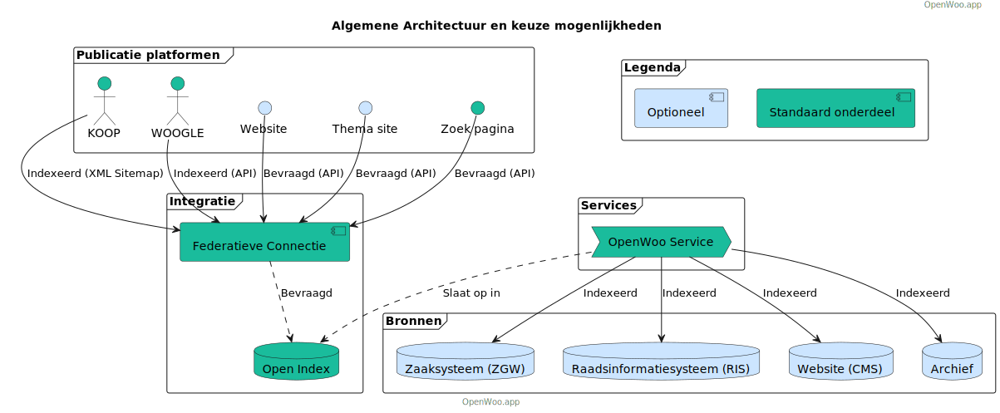

# (Open) WOO Website Template

Dit is een zelfstandig bruikbare uitbreiding op [Open WOO](https://github.com/OpenWebconcept/plugin-openwoo) van het [Open Webconcept](https://openwebconcept.nl/). Het maakt hergebruik van [NL Design (React componenten)](https://nldesignsystem.nl/meedoen/introductie) om aan de hand van [Design Tokens](https://nldesignsystem.nl/meedoen/design-tokens/) een gemeentelijk specifieke [WOO-index](https://www.koopoverheid.nl/voor-overheden/rijksoverheid/woo-index) pagina's te genereren die voldoet aan alle [WCAG](https://wcag.nl/kennis/richtlijnen/) en [wettelijke eisen](https://www.rijksoverheid.nl/onderwerpen/wet-open-overheid-woo).

## Opzet

Deze pagina kan rechtstreeks vanaf GitHub (serverless) of los op een eigen omgeving gehost worden. Vervolgens kan de voorkant rechtstreeks worden gekoppeld op de API van de Open WOO Open Webconcept plugin of de Open WOO Common Gateway plugin.

### WOO 1.0

Voor de eerste opzet van de WOO Index van BZK is het belangrijk dat organisaties zelf hun WOO-publicaties op een doorzoekbare index publiceren. BZK houdt vervolgens een overzichtspagina bij waarop per organisatie de algemene organisatiegegevens en de organisaties specifieke indexpagina vindbaar zijn.

### WOO 2.0

BZK heeft de ambitie om aan de hand van een harvester een eigen index op te bouwen op open.overheid.nl. Deze harvesters maakt gebruik van `robot.txt` en `sitemap.xml`-bestanden om de verschillende pagina's en metadata van de organisatie specifieke index te vinden en over te nemen. Dat betekent dat ook binnen de 2.0 variant van WOO een eigen indexpagina noodzakelijk blijft. Sterker nog, de kwaliteit van de ontsluiting wordt in grote mate afhankelijk van de kwaliteit van de index.

### Open versus WOO

De WOO specificeert een aantal categorieën (xie configuratie) die door een organisatie moeten worden ontsloten, dit template ondersteund dat, maar gaat een stap verder door organisaties ook categorieën te laten toevoegen. Hierdoor kan bredere invulling worden gegeven aan het concept "open" en kunnen bijvoorbeeld ook datasets of algoritmes worden ontsloten.

## Architectuur

## Varianten

### Open Webconcept variant

Als de voorkant direct wordt gedraaid op de Open Webconcept plugin kunnen WOO-verzoeken en convenanten gemakkelijk worden beheerd vanuit de reeds bestaande webomgeving en CMS.  In dit geval zijn er aan de kant van de organisatie geen verdere installatie of beheerstichtingen nodig (mits de organisatie beschickt over een OpenWebconcept installatie met de Open Woo en Open Convenanten plugins). In combinatie met het serverless kunnen draaien van de voorkant betekent dit een oplossing zonder server of hosting kosten waarbij simpelweg hergebruik gemaakt kan worden van bestaande Common Ground componenten

Nadeel van deze oplossingsrichting is dat WOO-verzoeken en convenanten handmatig moeten worden geüpload in de CMS-omgeving en dat de zoekbalk niet wordt ondersteund.

### Common Gateway variant

Het is ook mogelijk om de voorkant te koppelen aan een Common Gateway-installatie met daarop de Open WOO-plugin. Het voordeel hiervan is dat er kan worden doorgekoppeld op het zaaksysteem waardoor WOO-verzoeken en convenanten rechtstreeks kunnen worden gepubliceerd. Dit scheelt handwerk en voorkomt fouten. Tevens ondersteunt deze richting de zoekbalk. Het is ook mogelijk om dit te combineren met het binnentrekken van gegevens uit andere bronnen zoals een raadsinformatiesysteem op Open Webconcept CMS.

Nadeel van deze oplossingsrichting is dat de gemeente de Common Gateway (open source framework) of zelf zal moeten installeren of als SAAS afnemen.

## Functionaliteiten

- Serverless: Common WOO maakt gebruik van de RAD-architectuur principes voor het leveren van een Serverless voorkant.
Eigen huisstijl: Via NL Design tokens de gemeente haar eigen huisstijl gebruiken. Als er nog een NL Design tokens voor uw organisatie zijn helpen wij u uiteraard verder.
Geen handwerk: Door directe bron integratie is het niet nodig WOO-verzoeken etc actief te publiceren
- Als de gemeente gebruikmaakt van Open WOO kan er direct op de Open WOO-API worden gekoppeld
- Als de gemeente een zaaksysteem heeft wat ZGW gebruikt kan er via een gateway op het zaaksysteem worden gekoppeld (bijvoorbeeld xllnc, Roxit)
- WOO-verzoeken ook los worden toegevoegd als JSON-bestand.
- Kosteloos: Als de gemeente beschikt over een Bron, NL Design tokens en de interface servers draait zijn er geen kosten aan het gebruik verbonden.

## Voorbeelden

| Organisatie | WOO Pagina | WOO Bron(en)            |
|-------------|------------|-------------------------|
| [Noordwijk](https://conductionnl.github.io/woo-website-noordwijk/) | [Pagina](https://conductionnl.github.io/woo-website-noordwijk/) | Zaaksysteem (acceptatie) |
| [Tubbergen](https://conductionnl.github.io/woo-website-tubbergen/)| [Pagina](https://conductionnl.github.io/woo-website-tubbergen/)| Zaaksysteem (acceptatie) |
|[Epe](https://conductionnl.github.io/woo-website-epe/)| [Pagina](https://conductionnl.github.io/woo-website-epe/)| Zaaksysteem (acceptatie) |
|[Dinkelland](https://conductionnl.github.io/woo-website-dinkelland/)| [Pagina](https://conductionnl.github.io/woo-website-dinkelland/)| Zaaksysteem (acceptatie) |
|[Rotterdam (Alleen vormgeving)](https://conductionnl.github.io/woo-website-rotterdam/)| [Pagina](https://conductionnl.github.io/woo-website-rotterdam/)| Demo                    |
|[Noaberkracht](https://conductionnl.github.io/woo-website-noaberkracht/)| [Pagina](https://conductionnl.github.io/woo-website-noaberkracht/)| Zaaksysteem (acceptatie) |
 |[Leiden (Alleen vormgeving)](https://conductionnl.github.io/woo-website-leiden/)| [Pagina](https://conductionnl.github.io/woo-website-leiden/)| Demo                    |
 |[Xxllnc (Demo omgeving)](https://conductionnl.github.io/woo-website-xxllnc/)| [Pagina](https://conductionnl.github.io/woo-website-xxllnc/)| Demo                    |

## Roadmap

- Koppelen van Raadsinformatiesysteem (RIS), begin ontwikkeling medio september
- Beschikbaarstellen robot.txt en sitemap.xml tbv bzk, begin ontwikkeling begin oktober
- Uitleg pagina over categorien, nog geen ontwikkeling geplanned
- Landingspagina met themas aan de hand van tiles, nog geen ontwikkeling geplanned
- Kaartweergave, nog geen ontwikkeling geplanned

## Documentatie

- [Installatiehandleiding](docs/Installatie.md)
- [Configuratie](docs/Configuratie.md)
- [Testscenario's](docs/Tests.md)
.
