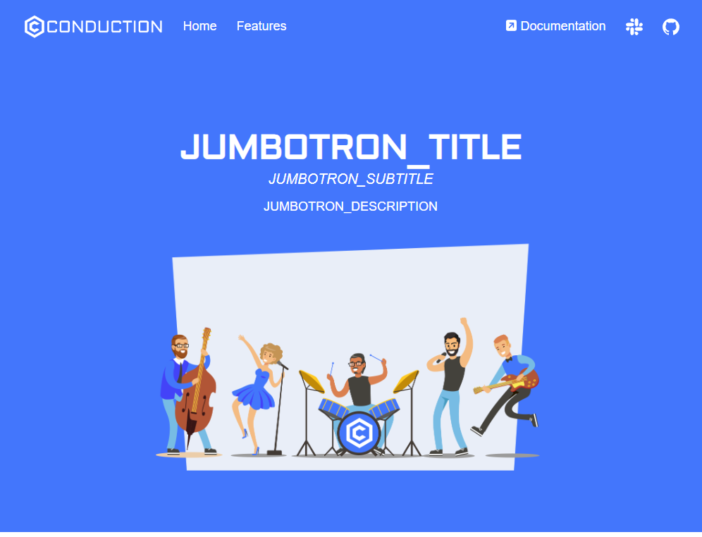

# The Jumbotron: A Powerful Tool for Showcasing Your Project

A jumbotron is a design element often used in web development to create a prominent section on a webpage. It's typically a large box that spans the full width of the screen, and it's usually placed at the top of the page. The term "jumbotron" comes from the Bootstrap framework, but the concept is used in many different design systems.

The jumbotron is a versatile tool that can be used to quickly convey the essence of your project. It's like a billboard that grabs the attention of visitors as soon as they land on your page. You can use it to display a bold title, a compelling subtitle, and a brief description of your project. You can also include a call-to-action button, guiding visitors towards a specific action, such as downloading your product, signing up for a newsletter, or viewing a demo.

In the context of the Product Website Template, the jumbotron can be customized to reflect the flavor and content of your project. You can set the `JUMBOTRON_TITLE`, `JUMBOTRON_SUBTITLE`, and `JUMBOTRON_DESCRIPTION` environment variables to display your project's name, tagline, and description. You can also set the `JUMBOTRON_SVG` variable to display an SVG that represents your project.

By effectively using the jumbotron, you can make a strong first impression and quickly communicate what your project is all about.

