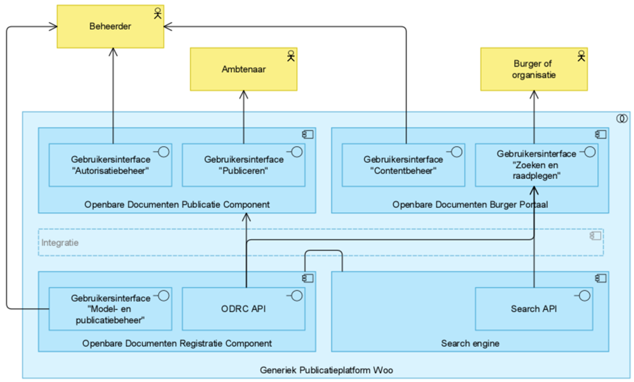
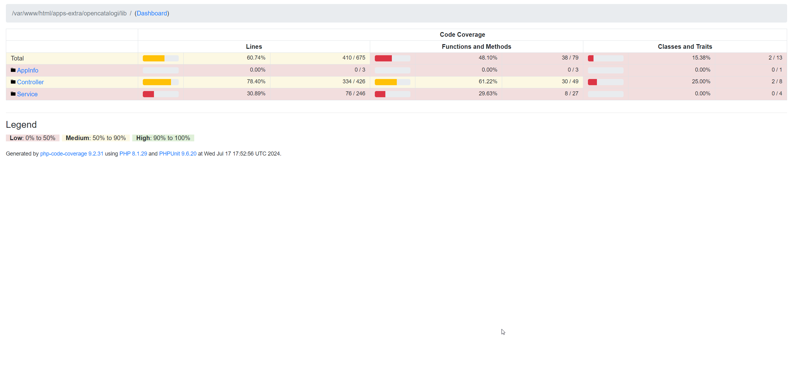

# Vragenlijst POC

## Common Ground Architectuur

### Voldoet de oplossing aan de CG architectuur? Zie ook figuur 5 in de PSA

Ja, de architectuur voldoet aan de Common Ground-architectuur (het heeft immers status [goud](https://app.powerbi.com/view?r=eyJrIjoiOWU4MjlmYTktNjE2MS00OGRhLTgwMjYtZWZhNTFhZmRhZjI2IiwidCI6IjZlZjAyOWFiLTNmZDctNGQ5OC05YjBlLWQxZjVmZWRlYTZkMSIsImMiOjh9&pageName=ffe4f1f9018d7bd035bc)). In principe is de OpenWoo.app een implementatie van de [OpenCatalogi-architectuur](https://documentatie.opencatalogi.nl/Handleidingen/Architectuur/) aangevuld met een aantal extra componenten en inrichtingen. De aanvullingen staan beschreven in de [OpenWoo](https://openwoo.app/Techniek/Architectuur/) architectuur. Deze komen neer op diverse extra frontends (de publicatiepagina's van de leveranciers) en een service voor het inladen van gegevens uit diverse bronnen.

Versimpeld komt de architectuur daarmee neer op:
.

Alle componenten zijn los te draaien en vervangbaar, en de inzet van meerdere frontends toont aan dat de applicatie voldoet aan een goede architecturale scheiding. De codebases van OpenCatalogi zelf zijn terug te vinden onder [OpenCatalogi architectuur](https://documentatie.opencatalogi.nl/Handleidingen/Architectuur/) en de aanvullende codebases van OpenWoo.app onder [OpenWoo architectuur](https://openwoo.app/Techniek/Architectuur/).

Als we de verschillende oplossingen in kaart brengen die invulling geven aan de bovenstaande componenten komen we uit op de volgende plaat:
 .

Opmerkingen

- Documenten worden (bij voorkeur) alléén opgeslagen in het documentmanagmentsysteem(DMS)
- Metadata over documenten wordt opgeslagen in de objectstore

### Wordt er een scheiding gemaakt tussen gegevens ontsloten door API's aan de ene kant en applicaties aan de andere kant? Slaat de applicatie zelf nog gegevens op direct in een database? Welke?

Ja, er wordt een duidelijke scheiding gemaakt tussen gegevens ontsloten door API's en applicaties. OpenWoo.app is ontworpen volgens de Common Ground principes, waarbij gegevens worden ontsloten via API's. Dit betekent dat de applicatie zelf niet direct gegevens opslaat, maar gebruikmaakt van API's om toegang te krijgen tot de benodigde data. Dit geldt bijvoorbeeld voor Publicaties en Bestanden. De beheerinterface beschikt daarnaast echter wel over een eigen database voor het opslaan van configuratie zoals rollen, rechten, logging, etc.
Het is belangrijk om te vermelden dat OpenCatalogi beschikt over drie mogelijkheden voor het opslaan van data:

- Opslag in MongoDB (hierbij wordt OpenCatalogi zelf een register)
- Opslag in Overige Objecten en Document Registratie Component
- Opslag in de interne PostgreSQL database van de beheeromgeving (alleen bedoeld voor demo en development)

In afwijking van de Dimpact-architectuur kiest OpenCatalogi (en daarmee OpenWoo.app) ervoor om documenten en de metadata daarvan los op te slaan. Metadata wordt opgeslagen als object en een document binnen een DMS (via DRC). De overweging hierachter is dat objecten en documenten gebaat zijn bij gespecialiseerde systemen, waarbij met name rondom documenten de inzet van een DMS binnen een overheid gangbaar is.

Daarmee is de volgende vertaaltabel te maken van de Dimpact Publicatie-PSA naar OpenWoo.app

| Doel | Dimpact component | OpenWoo.app component | Repository |
| ------ | ------------------|-----------------------|-------|
| Ambtenaar | Openbare Documenten Publicitie Component (Publiceren)| Publicatie Afhandel Component | Nog niet openbaar |
| Beheerder | Openbaar Documenten Burger Portaal (Contenbeheer)| Technische Beheer Omgeving | [OpenCatalogi.app](https://github.com/ConductionNL/opencatalogi) |
| Burger | Openbaar Documenten Burger Portaal (Zoeken en raadplegen)| Publicatie Platform | Nog niet openbaar |
| Opslag | Openbaar Documenten Registratie Component (Model en publicatiebeheer)| Technische Beheer Omgeving |  [OpenCatalogi.app](https://github.com/ConductionNL/opencatalogi) |
| Opslag | Openbaar Documenten Registratie Component (ODRC API)| Overige Objecten + Document Registratie Component | [Objects-api](https://github.com/maykinmedia/objects-api) , [Open zaak](https://github.com/open-zaak/open-zaak) |
| Index | Search Engine | Search Engine  | [Elastic](https://github.com/ConductionNL/opencatalogi) |

Hierbij hanteren we overigens scheiding tussen laag 1 en 2 waarbij op laag twee gebruik wordt gemaakt van "convience" APIs die bronnen combineren, te weten

- **Publicatie API** Gebruikt:
- - Objects API (voor publicatie objecten en meta data over documenten)
- - Documenten API (voor documenten)
- **Search API** Gebruikt:
- - Elastic API (voor zoeken)
- - Documenten API (voor ophalen en uitleveren van documenten)

Voor beide API's is de documentatie te vinden op [stoplight](https://conduction.stoplight.io/docs/open-catalogi/6yuj08rgf7w44-open-catalogi-api)

### Kun je ook andere applicaties aansluiten op de API's van de oplossing? Bijv. website, portaal of een mobiele app?

Zeker, sterker nog, dat is gangbaar. Er zijn op dit moment vijf verschillende publicatieplatformen aangesloten op de OpenCatalogi-API, waarvan vier onderdeel zijn van de OpenWoo.app community. In de [OpenWoo](https://openwoo.app/Techniek/Architectuur/) staat een overzicht met verwijzingen naar de codebases. Daarnaast maken Koop (via Koophulpje.nl), WooGLe en een tweetal gemeenten ook direct gebruik van de API. Er zijn op dit moment geen mobiele apps die gebruik maken van de API, maar er zijn wel organisaties die overwegen om deze in hun omgeving op te nemen (voor lokaal nieuws, met name het OpenWeb-concept).

In een bredere context zijn naast Koophulpje.nl (de sitemap.xml-adaptor voor KOOP) ook andere adapters in verkenning of ontwikkeling die de API weer omslaan naar externe bronnen (voor publiceren vanuit OpenCatalogi). Voorbeelden hiervan zijn DROP en SDG.

## Technologie

### Hoe ziet de technologiestack van de oplossing eruit? Taal, frameworks, databases, etc

- **Laag 5 en 4** Voor de publicatieplatformen (inwoners frontends) wisselen technologiestacks per leverancier. Conduction en Acato bouwen statische voorkanten aan de hand van het NL Design React framework (bijvoorbeeld de UI van de gemeente Tilburg) en IO Digital volledige PHP WordPress-plugins.
- **Laag 2** Op de backend zijn we recentelijk overgestapt van Conduction's eigen oude Common Gateway (PHP+React) naar het Nextcloud framework (PHP+Vue). Er zijn veel redenen voor deze overstap, die uitgelegd staan in een [blog](https://documentatie.opencatalogi.nl/Handleidingen/Nextcloud/), maar kort samengevat is Nextcloud als framework echt gericht op Kubernetes (en bevat dus van zichzelf integratie voor logging, monitoring, ADFS, etc.).
- **Laag 1** Op de datalaag wordt er door Nextcloud zelf gebruik gemaakt van [PostgreSQL](https://www.postgresql.org/). Vanuit applicatieoogpunt schrijven we de overige data bij voorkeur weg naar objectregistraties (zoals overige objecten of MongoDB) en documenten naar een gespecialiseerd documentmanagementsysteem (zoals documentregistratiecomponent). Voor zoekfuncties wordt weggeschreven naar een gespecialiseerde zoekindex (Elastic Search).

### Welke bestaande componenten (zoals Elastic of KeyCloak) worden gebruikt?

OpenWoo.app maakt gebruik van diverse bestaande componenten om een robuuste, veilige en schaalbare oplossing te bieden. Hieronder staan de belangrijkste componenten die in de technologiestack worden gebruikt:

- Document Registratie Component (uit bijvoorbeeld Open Zaak)
- Object Registratie Component
- Object Type Catalogus
- Elasticsearch
- FSC/NLX
- Nextcloud als basisframework
- Diverse NL Design React componenten

Daarnaast is het belangrijk om te vermelden dat de keuze voor Nextcloud als basisframework voortkomt uit de goede out-of-the-box ondersteuning voor Keycloak, Splunk, Nagios, Apache Spark, Prometheus, Loki, Grafana, Harbour, OpenShift en Azure. Dit is belangrijk omdat dit het platform goed schaalbaar en monitorbaar maakt in complexe Kubernetes-omgevingen en daarmee bij uitstek geschikt is voor uitlevering als SAAS-platform.

### Zijn er automatische tests? Welke soort (unit, end-to-end)? Wat is de dekkingsgraad?

We draaien beide soorten tests. Voor end-to-end testing maken we gebruik van [Vitest](https://vitest.dev/) en voor unit tests van [PHPUnit](https://phpunit.de/index.html) en [Jest](https://jestjs.io/). De test coverage wisselt rond de 60 procent. Het doel is om dat voor 12 augustus naar 80% te hebben. Meer documentatie hierover is opgenomen in de [GitBook](https://conduction.gitbook.io/opencatalogi-nextcloud/developers/verder-documentatie) van de OpenCatalogi Nextcloud-app.

### Zijn er installatiescripts? Is er een Helm-chart? Zijn voldoende omgevingsvariabelen ontsloten voor een volledige automatische installatie?

Zeker, goede installeerbaarheid was een drijfveer achter deze stackkeuze. Simpel gezegd komen alle OpenCatalogi-installaties neer op drie stappen, met een extra stap voor OpenWoo.app:

1. Installeer Nextcloud:
   - Via Helm, zie [Artifact Hub](https://artifacthub.io/packages/helm/nextcloud/nextcloud)
   - Als Azure-app, zie de [Azure Marketplace](https://azuremarketplace.microsoft.com/en-us/marketplace/apps/nextcloudgmbh1597841818906.nextcloud?tab=overview)
   - Via OpenShift, zie de [OpenShift-catalogus](https://catalog.redhat.com/software/container-stacks/detail/65e9dc6f6365ba88288a412c)
2. Activeer de OpenCatalogi-app, instructie op de [OpenCatalogi GitBook](https://conduction.gitbook.io/opencatalogi-nextcloud/developers/installatie-via-nextcloud-lokaal-deel-2-een-app-toevoegen)
3. Configureer de Nextcloud-app, instructie op de [OpenCatalogi GitBook](https://conduction.gitbook.io/opencatalogi-nextcloud/developers/installatie-via-nextcloud-lokaal-deel-2-een-app-toevoegen)
4. Installeer de WooPublicatie-pagina, instructies op de [OpenWoo.app GitHub](https://github.com/ConductionNL/woo-website-template)

Deze stappen staan ook nader beschreven in de nieuwe [OpenCatalogi GitBook](https://conduction.gitbook.io/opencatalogi-nextcloud).

Voor (lokaal) ontwikkelen en demo's is er ook een `docker-compose` voor het draaien in een container. De instructies zijn [hier](https://conduction.gitbook.io/opencatalogi-nextcloud/developers/installatie-via-docker) te vinden. Deze wordt momenteel door Acato getest (so far so good).

Na installatie zijn er enige (optionele) vereisten, zoals een API-sleutel voor MongoDB en clusternaam en voor het activeren van Elastic een sleutel en index of voor productieomgevingen toegang tot de objecten API, objecttype API en documentregistratiecomponent.

## Bronnen

### Welke bronnen kunnen nu worden aangesloten?

Momenteel de volgende bronnen:

- (xxllnc) zaaksysteem.nl
- ZGW-API-bronnen (DRC en ZRC)
- ORI-API-bronnen (Notubiz en andere raadsinformatiesysteemleveranciers)
- Objectregistraties (MongoDB en overige objecten)
- SharePoint
- StUF en ZDS
- Bronnen met een REST API kunnen in theorie worden geconfigureerd

Daarnaast zijn er ook diverse afnemeners van de search api

- KOOP
- WooGLe
- IO (website)
- Acato (publicatieplatform)
- Yard (website)

### Is er een adapter framework of iets anders voor het aansluiten van nieuwe bronnen?

Ja, momenteel gebruiken we voor dit specifieke stukje van het ecosysteem nog wel de CommonGateway. Dat werkt aardig (Acato heeft daar nu ook de eerste koppelingen mee gemapped), maar we willen deze eigenlijk ook overzetten naar een Nextcloud-app voor Kubernetes. Voor zaakgerichtwerken, objectregistraties en open raadsinformatie is er nu al een adapter voor ondersteuning en Tilburg en Acato zijn aan het afronden op StUF en SharePoint.

Deze adapter voorziet in het ontsluiten van bronnen náár het publicatieregister toe. Omdat Dimpact binnen de MVP gebruikmaakt van handmatig publiceren, is de CommonGateway voor de MVP out of scope. In een bredere context geldt dat we de CommonGateway in Q3 gaan uitfaseren. Het doel is om bij de inwerkingtreding Woo (1 november) alles op Nextcloud te draaien.

### Worden bronnen via streaming aangesloten? Of is dat batch (bijv. 's nachts of ieder uur)?

Beide, bij voorkeur gebruiken we een [pubsub-patroon](https://en.wikipedia.org/wiki/Publish%E2%80%93subscribe_pattern) zoals notificaties bij ZGW. Bij pubsub nemen we een notificatie op CRUD acties op bron objecten (bijvoorbeeld zaken van het type w00-verzoeken) en werken we het publicatie opbject bij op het moment dat er iets wijzigd in de onderligende zaak. Zo zorgen we dat gegevens altijd bij zijn, en we niet afhankenlijk zijn van nachtenlijk crawlen of harvesten. Maar in de praktijk ondersteunen lang niet alle pakketten dit. In die gevallen grijpen we terug op batchverwerking. Hoe vaak die draaien hangt van de bron af en is per bron instelbaar. Dat kan elk uur of elke nacht. Maar als de bron bijvoorbeeld kan filteren op items die afgelopen x minuten zijn gewijzigd, kijken we graag iedere 5 tot 10 minuten even (als het antwoord dan leeg is, zijn we ook niet excessief aan het vragen).

## Zoeken

### Hoe verhoudt de zoekindex zich tot de ODRC?

Deze is bewust losgekoppeld, we hanteren het principe dat in de zoekindex alleen openbare informatie mag staan.

### Slaat Elastic alle gegevens (docs) zelf op?

Dat hangt van de configuratiekeuzes van de gemeente af, maar bij voorkeur slaan we alleen de metadata van documenten op en halen we het document zelf uit het DRC op het moment dat het wordt opgevraagd. Er zijn echter casussen waarin dat vanuit belasting of performance niet wenselijk is.

### Is de API voor zoeken een Elastic API of specifieke API voor WOO?

Het is een specifieke API voor de WOO die binnen de parameters valt van wat Elastic zelf ook kan leveren met wat configuratie. Met andere woorden, de Elastic-instantie kan ook direct worden bevraagd. De adapter erbovenop voorziet echter in twee extra functionaliteiten die wij binnen de WOO wenselijk vinden:

- Federatief zoeken over meerdere Elastic Search-instanties
- Ophalen documenten door routeren naar bijvoorbeeld DRC in plaats van Elastic.

### SaaS

### Dimpact wil de oplossing als SaaS-dienst aanbieden aan haar leden. Wat is er nodig om de oplossing als SaaS aan te bieden?

Een Kubernetes- of Azure-omgeving met daarop bij voorkeur een managementtool voor container orchestratie die Artifact Hub ondersteunt (er zijn er een aantal). In dat geval kan er visueel geïnstalleerd worden.

Daarnaast ondersteunen we best een flink aantal monitoring- en dashboardtools, het is verstandig om die ook operationeel te hebben (bijvoorbeeld Grafana).

### Hoe ziet een gemeentelijke implementatie eruit? Ervan uitgaande dat alle technische integratie al gedaan is bij installatie?

Hiervoor is een handleiding beschikbaar op <https://openwoo.app/Techniek/Productie/>.

## Authenticatie en autorisatie

### Kan de oplossing worden aangesloten op AD (OIDC)?

Ja, Nextcloud werkt met LDAP voor het AD, of (onder andere) ADFS voor SSO. Hiervoor zijn meerdere [handleidingen](https://www.schiessle.org/articles/2023/07/04/nextcloud-and-openid-connect/) beschikbaar die bijvoorbeeld ook gebruik maken van Keycloak (er kan ook direct met LDAP op AD worden gekoppeld).

### Hoe worden rollen en rechten ingeregeld? Kan de oplossing rollen uit AD gebruiken?

Dit werkt via [LDAP](https://docs.nextcloud.com/server/latest/admin_manual/configuration_user/user_auth_ldap.html). De oplossing kan dus de rollen uit het AD overnemen. Het toekennen van specifieke rechten aan rollen (bijvoorbeeld publiceren) gebeurt vervolgens in de applicatie zelf. Ook kunnen in de applicatie rollen worden aangemaakt waardoor er flexibiliteit is ten aanzien van de rollen structuur van de afnemende overheid.

### Kunnen beide bij installatie worden ingericht via de Helm-chart?

Ja, voor zover wij weten zijn alle configuratieopties (dus ook adapters) via de config-optie van de [Helm-chart](https://artifacthub.io/packages/helm/nextcloud/nextcloud?modal=values) in te stellen. Dat betekent dus dat de applicatie (in theorie) volledig werkend kan worden opgespannen.

## Standaarden

### Welke standaarden worden nu al gebruikt en ondersteund? TMLO, ZGW API's, etc

- ZGW
- REST API (OpenAPI)
- MDTO (voorheen TMLO)
- JSON-LD
- [Triple Store](https://en.wikipedia.org/wiki/Triplestore)
- Geo-JSON
- NFC/NLX

Zie voor meer standaarden de [OpenCatalogi Architectuur](https://documentatie.opencatalogi.nl/Handleidingen/Architectuur/).

### Is de ODRC API een standaard API?

Het is een API die volgens de NL API-strategie functioneert, met 'reguliere' endpoints en convenience-endpoints. We zijn nu in overleg met VNG en KOOP over standaardisatie, we verwachten daarbij maandag 22 juli een eerste besluit vanuit Koop. De VNG heeft 27 juni reeds aangegeven de API als kandidaat te zien.

## **Aan te tonen functionaliteiten bij PoC OpenWoo.app**

Onderstaande functionaliteiten worden ondersteund of worden op zeer korte termijn gerealiseerd.

## ODRC / gebruikersinterface “Model- en publicatiebeheer”

1. Inloggen (met SSO?)

- SSO via ADFS of SAML via Nextcloud

2. Modelbeheer:
Toevoegen, wijzigen en intrekken/verwijderen van extra informatiecategorieën, rekening houdend met TOOI-waardelijst
Toevoegen, wijzigen en intrekken/verwijderen van organisaties, rekening houdend met TOOI-waardelijst
Toevoegen, wijzigen en intrekken/verwijderen van organisatie-onderdelen
Toevoegen, wijzigen en intrekken/verwijderen van extra metadata-velden (per informatiecategorie)
Toevoegen, wijzigen en intrekken/verwijderen van thema’s/onderwerpen

De OpenWoo.app ondersteunt het CRUD + intrekken van alle bovenstaande functionaliteiten voor het beheer van de modellen.

3. Publicatiebeheer:

- a. Wijzigen en intrekken/verwijderen van een concept-publicatie
- b. Wijzigen en intrekken/verwijderen van een publicatie
- c. Waarderen archief
- d. Raadplegen logging/audittrail van een (concept-)publicatie
- e. Rapportages

De OpenWoo.app ondersteunt het CRUD + intrekken van alle bovenstaande functionaliteiten voor het beheer van de publicaties.

4. Help-functie

Er wordt nagedacht over help-functies binnen de beheerinterface. Denk hierbij aan tooltips en documentatie voor zowel gebruikers, beheerders als ontwikkelaars van het ODRC.

## ODPC / gebruikersinterface “Autorisatiebeheer”

5. Inloggen (met SSO?)

Dit gebeurt op dezelfde manier als het inloggen voor het ODRC, via ADFS, LDAP of SAML.

6. Toevoegen, wijzigen en verwijderen van autorisatiegroepen

Gebruikers kunnen autorisatiegroepen toevoegen, wijzigen en verwijderen. Deze groepen worden beheerd via LDAP.

7. Medewerkers toevoegen aan en verwijderen uit een autorisatiegroep

Medewerkers kunnen worden toegevoegd aan of verwijderd uit een autorisatiegroep. Dit wordt beheerd via LDAP.

8. Een autorisatiegroep autoriseren voor:

- a. Informatiecategorieën (cq “publiceren van”)
- b. Organisaties (cq “publiceren namens”)
- c. Organisatie-onderdelen (cq “publiceren namens”)
- d. Thema’s/onderwerpen (cq “publicatie hoort bij”)

Configuratie en authorisatieschema's: De configuratie en authorisatieschema's voor bovenstaande autorisaties worden al ondersteund via LDAP. De beheerinterface voor het uitvoeren van deze taken wordt momenteel ontwikkeld.

9. Raadplegen logging van (wijzigingen in) autorisaties

Het is een herleidbaar audittrail dat inzichtelijk wordt gemaakt voor het raadplegen van de logging.

10. Help-functie

Er wordt nagedacht over help-functies binnen de beheerinterface. Denk hierbij aan tooltips en documentatie voor zowel gebruikers, beheerders als ontwikkelaars van het ODPC.

## ODPC / gebruikersinterface “Publiceren”

11. Inloggen (met SSO?)

Dit gebeurt op dezelfde manier als het inloggen voor het ODRC, via ADFS, LDAP of SAML.

12. Aanmaken nieuwe (concept-)publicatie, met o.a.:

- a. Uploaden van een of meerdere bestanden
- b. Selecteren van een of meerdere informatiecategorieën
- c. Selecteren van een organisatie
- d. Selecteren van een of meerdere thema’s/onderwerpen
- e. Verplichte DiWoo-velden
- f. Invullen van extra metadata-velden
- g. Opslaan als concept of direct publiceren

Alle bovenstaande functionaliteiten worden ondersteund in het publicatiemodel in de beheerinterface voor publicaties.

13. Een concept-publicatie muteren en alsnog publiceren

14. Een publicatie intrekken

Publicaties intrekken wordt al ondersteund door het verwijderen van een verplicht veld. Zo is een conceptpublicatie ook al gelijk ondersteund. Met andere woorden, een publicatie zonder alle verplichte velden ís een concept-publicatie. Let wel op dat als een publicatie eenmaal is gepubliceerd en een derde partij een kopie heeft gemaakt, de OpenWoo.app daar niets meer aan kan doen. In dat geval moet er contact opgenomen worden met bijvoorbeeld WooGle of KOOP.

15. Help-functie

Er wordt nagedacht over help-functies binnen de beheerinterface. Denk hierbij aan tooltips en documentatie voor zowel gebruikers, beheerders als ontwikkelaars van het ODPC.

## ODBP / gebruikersinterface “Contentbeheer”

16. Inloggen (met SSO?)

Dit gebeurt op dezelfde manier als het inloggen voor het ODRC, via ADFS, LDAP of SAML.

17. Wijzigen welkomstpagina

Dit wordt ondersteund.

18. Aanmaken, wijzigen en verwijderen webpagina met overzicht andere relevante websites

Deze functie wordt niet direct door OpenCatalogi ondersteund, althans content en url-beheer zoals we dat kennen binnen CMS-systemen. We kunnen natuurlijk prima een metadatatype toevoegen (of de gebruiker zelf) voor pagina's. Op dezelfde manier als waarop we die kennen voor producten en diensten (SDG) en nieuwsberichten.

19. Raadplegen rapportage bezoekers-/gebruiksstatistieken

Dit wordt ondersteund door bijvoorbeeld Google Analytics, Nextcloud Analytics, maar er kan gedacht worden aan dit op te lossen via Elastic(Stack) in hoeverre hier vraag naar is.

20. Help-functie

Er wordt nagedacht over help-functies binnen de gebruikersinterface. Denk hierbij aan tooltips en documentatie voor zowel gebruikers, beheerders als ontwikkelaars van het ODBP.

## ODBP / gebruikersinterface “Zoeken en raadplegen”

21. Huisstijl / NL design
22. Raadplegen welkomstpagina (zie 17) en overige pagina’s (zie 18)
23. Zoeken met behulp van een zoekbalk:

- a. Full-tekst
- b. In metadata-waarde

24. Gebruik van boolean operators
25. Zoeken met behulp van filters
26. Raadplegen lijst met zoekresultaten
27. Openen van een zoekresultaat en raadplegen van een publicatie
28. Downloaden van een publicatie

Alle bovenstaande functionaliteiten worden ondersteund.

29. Help-functie

Er wordt nagedacht over help-functies binnen de gebruikersinterface. Denk hierbij aan tooltips en documentatie voor zowel gebruikers, beheerders als ontwikkelaars van het ODBP.

## Technisch

29. ODRC API:

- a. Raadplegen model (zie 2)
- b. Creëren, raadplegen, updaten en verwijderen van (concept-)publicaties

Wordt ondersteund via API. Sterker nog, de interfaces sturen de API aan.

30. Search API

De search API is het kloppende hart van OpenCatalogi. Het ondersteunt naast full-text search twee belangrijke mogelijkheden:

- Aggregated search (ofwel federatief over organisaties zoeken)
- Faceted search (van te voren zien hoeveel zoekresultaten een aanpassing in de zoekopdracht oplevert)

De documentatie van de search API is aan uitbreiding onderhevig, maar bevindt zich momenteel op [Stoplight](https://conduction.stoplight.io/docs/open-catalogi/6yuj08rgf7w44-open-catalogi-api) (een API-design tool).

31. Genereren sitemap(-index)

Op dit moment heeft OpenWoo.app een tweetal keer meegedaan aan de beproeving van de sitemap-XML-koppeling naar KOOP. Een keer met als onderliggende bron zaaksysteem.nl en een keer met Notubiz. Beide keren zijn de gegevens succesvol overgebracht naar KOOP (en trouwens ook Woogle). Wel merken we hierbij de volgende problemen op:

- Het sitemap-XML-formaat slaat de gegevens plat, hierdoor verdwijnen onderlinge verbanden tussen publicaties. Een voorbeeld hiervan is een raadsstuk. Daarvan wil je eigenlijk zien dat het daarvoor in een commissie is behandeld en daarvoor bij B&W. In de opbouw van KOOP gaat deze context verloren, terwijl juist dit interessant is voor het transparant maken van besluitvorming.
- KOOP ondersteunt geen videobestanden
- KOOP ondersteunt alleen documenten, waardoor sommige objecten (e.g. raadsagenda's) moeten worden omgezet naar PDF en minder toegankelijk worden.
