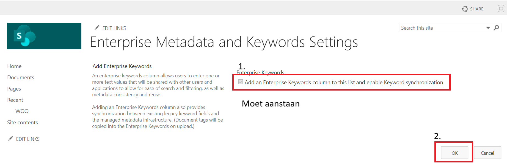
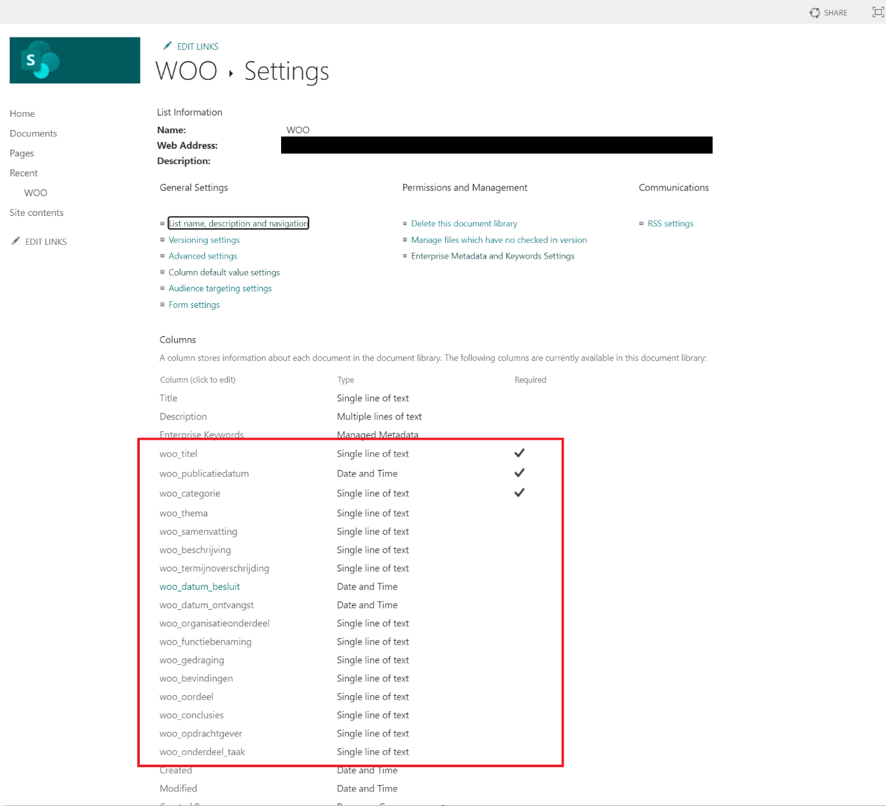

# Sharepoint

## Algemene uitleg

Sharepoint kan gebruikt worden als bron voor Woo publicaties.

Er moet een folder zijn voor de publicaties zodat daar een endpoint voor gegenereerd wordt waar publicaties van opgehaald kan worden. Bijvoorbeeld: `/_api/Web/GetFolderByServerRelativePath(decodedurl='/WOO/Woo-verzoeken en -besluiten')/folders`
Het makkelijkste is om alle publicaties in 1 folder ipv hier in het slechte voorbeeld te splitsen.

1 folder in de algemene publicatie folder representeert 1 publicatie.

Met daarin de bijbehorende bijlagen/documenten.

## Configuratie

Er moet wat geconfigureerd worden in sharepoint om per publicatie (folder) metadata toe te kunnen voegen. Zodat de publicaties in lijn zijn met https://openwoo.app/Techniek/Configuratie/

Ga naar library settings

Ga naar metadata settings.

Zet metadata aan.

Maak voor elk veld van de configuratie https://openwoo.app/Techniek/Configuratie/ een column.

Voorbeeld minimale velden.

Voorbeeld alle velden waaronder optionele velden.

## Publicatie metadata wijzigen

Om de publicatie velden die geconfigureerd zijn in te vullen of te wijzigen moet je naar een van je categorie mappen en klik je op grid edit. Na het invullen van de velden kan je linksboven op exit grid klikken en wordt er opgeslagen.

